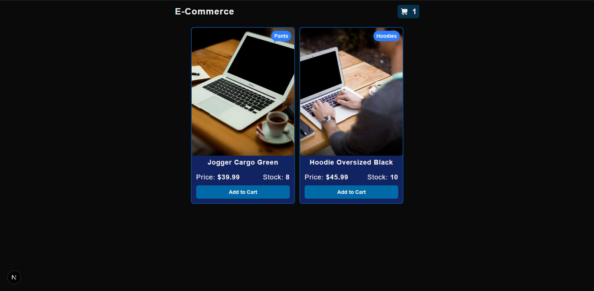
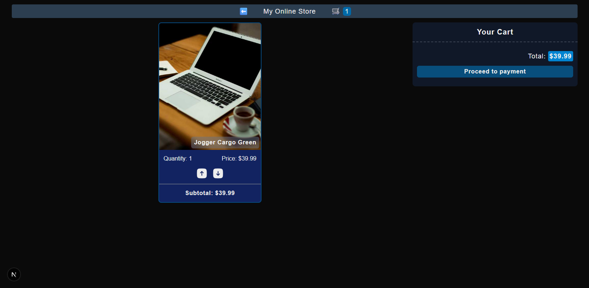
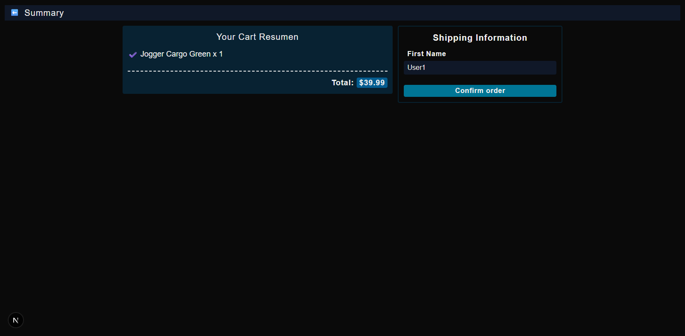
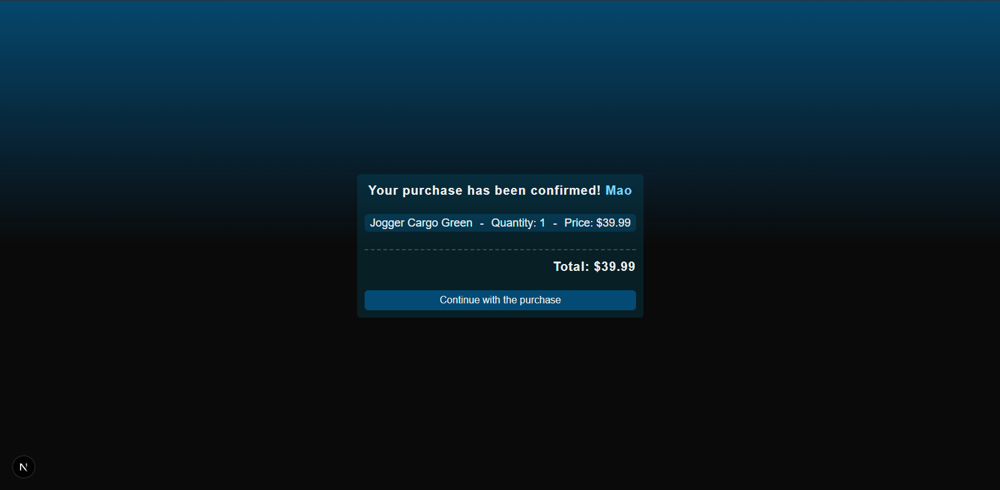

# E-Commerce App

App de e-commerce con carrito de compras persistente, catálogo desde Firestore y flujo de checkout completo.

## Tecnologías

- **Next.js 16** — App Router, Server/Client Components
- **React 19** — Context API, hooks
- **Firebase 12** — Firestore (productos, órdenes)
- **TypeScript** — Tipado estricto
- **Tailwind CSS 4** — Estilos utilitarios
- **Vitest** — Tests unitarios
- **react-hook-form** — Formulario de checkout

## Funcionalidades

- Catálogo de productos desde Firestore con loading skeleton e imágenes dinámicas
- Carrito de compras con persistencia en localStorage
- Validación de stock antes de agregar al carrito
- Checkout con formulario y guardado de órdenes en Firestore
- Página de confirmación con resumen de la orden
- Diseño responsive (mobile-first)

## Estructura

```
app/
├── components/     # UI (Card, Header, Skeleton)
├── context/        # ProductContext, CartContext
├── lib/firebase/   # Config, queries (products, orders)
├── utils/          # Lógica de carrito y validación
├── checkout/       # Página de pago
├── cart/           # Carrito de compras
└── success/        # Confirmación de orden
```

## Screenshots

### Home Page


### Cart Page


### Checkout Page


### Success Page


## Instalación

```bash
npm install
npm run dev
```
